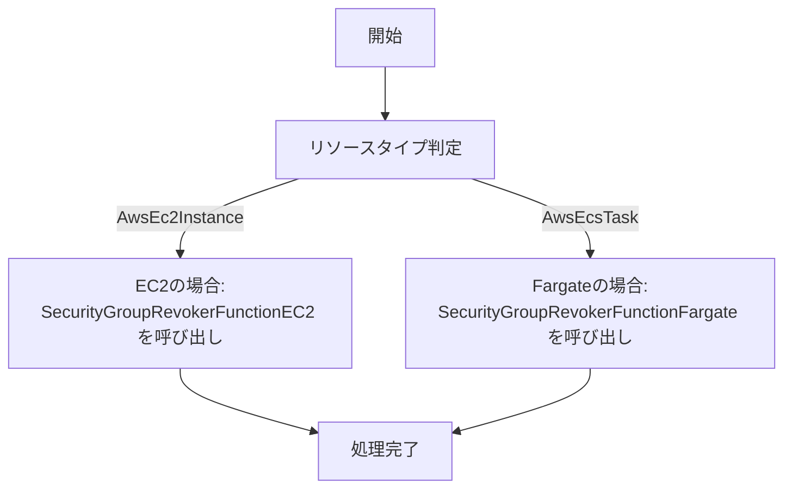

# cloudfastener-guardduty-automated-response

このリポジトリは、GuardDutyのFindingを自動で処理し、特定のセキュリティアクションを実施するCloudFormationテンプレートを提供します。

## 概要
このプロジェクトは、ASecurity HubのFindingをEventBridgeでキャプチャし、Step Functionsを使用して以下の2つのアクションを自動実行します。

1. **Security GroupのIngress/Egressルール削除**
   - GuardDutyのFindingに基づいて、対象のEC2またはECS Fargateのセキュリティグループの`ingress`および`egress`ルールを削除します。

2. **AWS Network FirewallにIPアドレスを追加**
   - GuardDutyのFindingに基づいて、悪意のあるIPアドレスをNetwork Firewallのブロックリストに追加します。

## ディレクトリ構成

| パス | 説明 |
|------|------|
| `guardduty-autoresponse/` | プロジェクトのルートディレクトリ |
| ├── `README.md` | プロジェクトの概要 |
| ├── `securitygroup-removal/` | Security Group ルール削除用のテンプレート |
| │ ├── `securitygroup-removal.yaml.yaml` | CloudFormationテンプレート |
| │ ├── `deployment-guide.md` | デプロイ手順 |
| ├── `networkfirewall-ipblock/` | Network Firewall にIPを追加するテンプレート |
| │ ├── `aws-networkfirewall-guardduty.yaml` | CloudFormationテンプレート |
| │ ├── `deployment-guide.md` | デプロイ手順 |

## デプロイ方法
各ディレクトリにある `deployment-guide.md` を参照してください。

## アーキテクチャ図
```mermaid
flowchart TD
    A[Security Hub<br/>(GuardDuty Findings<br/>インポート済み)]
    B[EventBridge ルール]
    C[Step Functions<br/>State Machine]
    D{リソースタイプ判定}
    E[SecurityGroupRevokerFunctionEC2<br/>(Lambda)]
    F[SecurityGroupRevokerFunctionFargate<br/>(Lambda)]
    G[EC2 / ECS API<br/>Describe & Revoke SG Rules]

    A --> B
    B --> C
    C --> D
    D -- "AwsEc2Instance" --> E
    D -- "AwsEcsTask" --> F
    E --> G
    F --> G
```

```

```

## ワークフロー図

