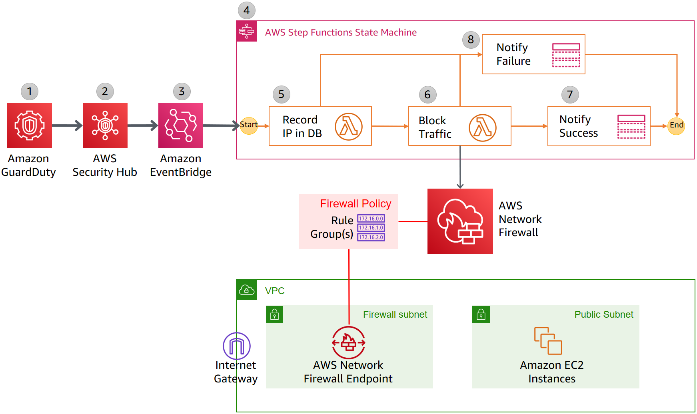
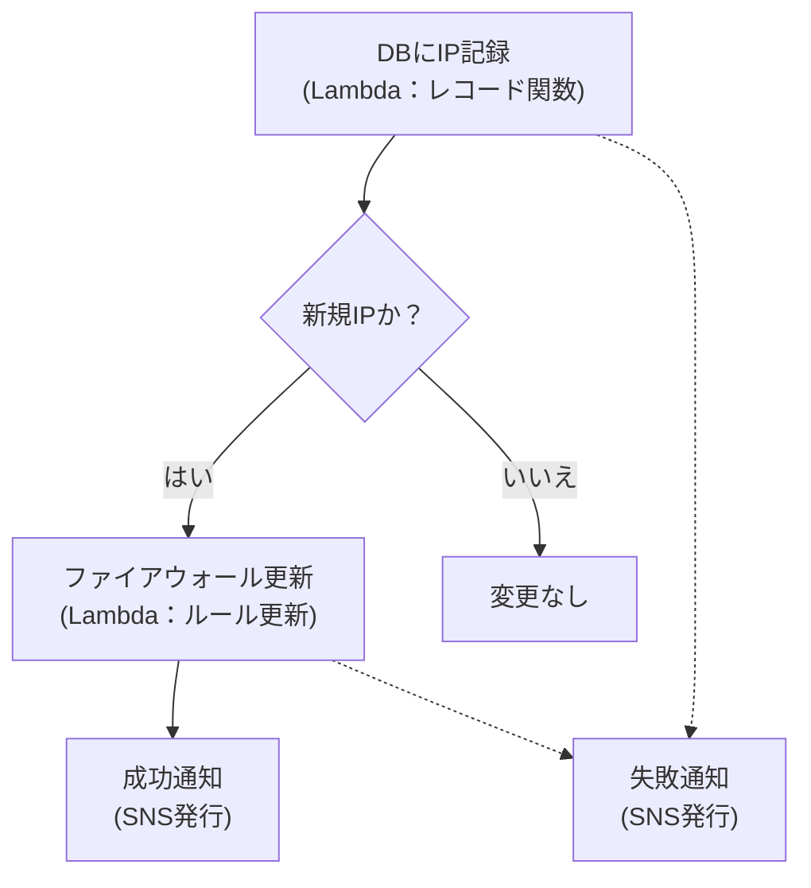

## アーキテクチャ図



## ワークフロー図



## **前提条件**
- GuardDuty が有効になっている
- Security Hub が GuardDuty の Findings を統合している
- AWS Network Firewall が設定済み
- CloudFormation スタックのデプロイ時に、以下のパラメータを指定する必要がある

| パラメータ | 説明 | デフォルト値 |
|-----------|------|------------|
| `AdminEmail` | 通知を受け取るメールアドレス | なし（必須） |
| `RulegroupPriority` | Network Firewall ルールグループでの優先度 | `30000` |
| `RulegroupCapacity` | ルールグループの容量（各ブロックルールが2ユニット消費） | `2000` |
| `Retention` | ブロックリストの IP を保持する時間（分） | `720`（12時間） |
| `PruningFrequency` | ブロックリストから古いエントリを削除する頻度（分） | `15` |

## **デプロイ手順（CLI）**

次のコマンドを実行し、CloudFormation スタックをデプロイします。

```sh
aws cloudformation deploy \
  --stack-name networkfirewall-ipblock \
  --template-file networkfirewall-ipblock/aws-networkfirewall-guardduty.yaml \
  --capabilities CAPABILITY_NAMED_IAM \
  --parameter-overrides \
    AdminEmail="your-email@example.com" \
    RulegroupPriority=30000 \
    RulegroupCapacity=2000 \
    Retention=720 \
    PruningFrequency=15
```

## **削除手順（CLI）**
```
aws cloudformation delete-stack --stack-name networkfirewall-ipblock
```