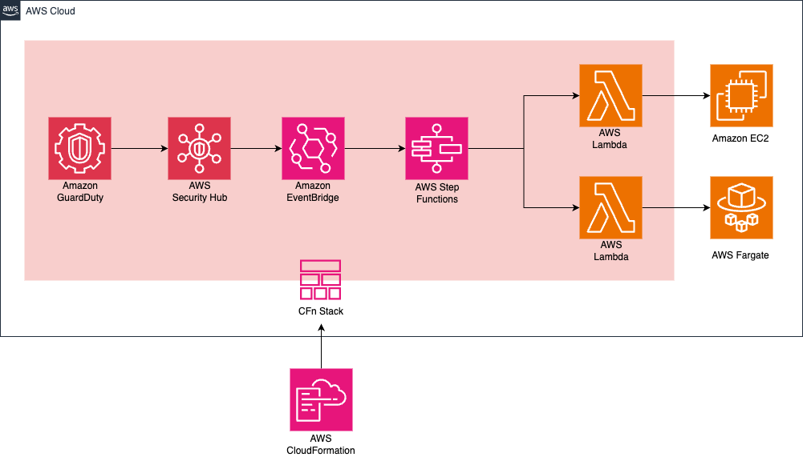

## アーキテクチャ図




## ワークフロー図


## **デプロイ手順（CLI）**

次のコマンドを実行し、CloudFormation スタックをデプロイします。

```sh
aws cloudformation deploy \
  --stack-name securitygroup-rule-removal \
  --template-file securitygroup-removal/securitygroup-removal.yaml \
  --capabilities CAPABILITY_NAMED_IAM
```

## **削除手順（CLI）**
```
aws cloudformation delete-stack --stack-name securitygroup-rule-removal
```